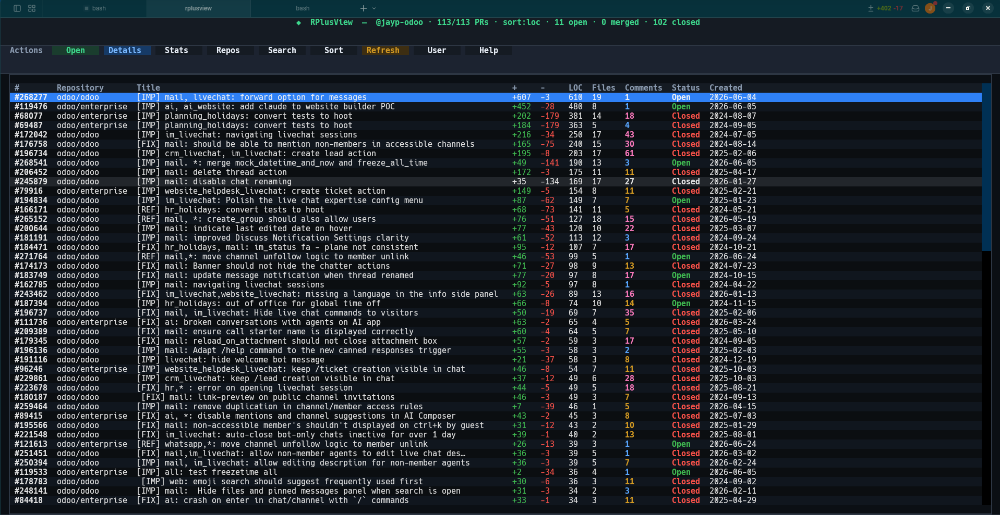

<p align="center">

```text
██████╗ ██████╗ ██╗     ██╗   ██╗███████╗██╗   ██╗██╗███████╗██╗    ██╗
██╔══██╗██╔══██╗██║     ██║   ██║██╔════╝██║   ██║██║██╔════╝██║    ██║
██████╔╝██████╔╝██║     ██║   ██║███████╗██║   ██║██║█████╗  ██║ █╗ ██║
██╔══██╗██╔═══╝ ██║     ██║   ██║╚════██║╚██╗ ██╔╝██║██╔══╝  ██║███╗██║
██║  ██║██║     ███████╗╚██████╔╝███████║ ╚████╔╝ ██║███████╗╚███╔███╔╝
╚═╝  ╚═╝╚═╝     ╚══════╝ ╚═════╝ ╚══════╝  ╚═══╝  ╚═╝╚══════╝ ╚══╝╚══╝
```

</p>

<p align="center">
  <b>A colorful terminal dashboard for your GitHub pull requests</b><br/>
  Search · Sort · Inbox · Stats · Repos · Open in browser · First-run setup
</p>

<p align="center">
  <a href="https://pypi.org/project/rplusview/"></a>
  <a href="https://pypi.org/project/rplusview/"></a>
  <a href="https://github.com/jayyypatel/rplusview/blob/main/LICENSE"></a>
  <a href="https://github.com/jayyypatel/rplusview/actions/workflows/ci.yml"></a>
</p>

<p align="center">
  
  
  <a href="https://github.com/jayyypatel/rplusview/stargazers"></a>
  <a href="https://github.com/jayyypatel/rplusview/issues"></a>
</p>

<p align="center">
  <strong>Open source under the <a href="LICENSE">MIT License</a></strong> — fork it, improve it, ship PRs.<br/>
  Maintainer-only PyPI releases · community contributions welcome via GitHub.
</p>

---

## Demo

<p align="center">
  
</p>

---

## Why RPlusView?

GitHub’s web PR list is fine. Your terminal can be faster.

RPlusView is a **Textual TUI** that loads your pull requests over the GitHub GraphQL API, then lets you search, sort, triage an inbox, inspect details, and jump to the browser — without leaving the keyboard.

| | Capability |
|---|---|
| Dashboard | Open PRs first (fast); toggle closed/merged when you need history |
| Inbox | Drafts, needs action, review requests — Pulls-style panels |
| Navigation | Vim `j`/`k`, `gg`/`G`, page keys, live `/` search |
| Insights | Stats and per-repo breakdowns (LOC, open/merged/closed) |
| Setup | First-run welcome; change user or token anytime (`u`) |

---

## Install

**From PyPI (recommended):**

```bash
pip install rplusview
```

**From source (latest `main`):**

```bash
git clone https://github.com/jayyypatel/rplusview.git
cd rplusview
pip install .
```

**Requirements:** Python **3.10+**, a GitHub personal access token.

---

## Quick start

```bash
# 1) Install
pip install rplusview

# 2) Provide a token (pick one)
export GITHUB_TOKEN=ghp_your_token_here
# or: copy .env.example → .env and set GITHUB_TOKEN
# or: paste the token in the first-run / User (u) screen

# 3) Launch
rplusview
```

On first launch, enter the **GitHub username** whose PRs you want to track.  
That username (and optionally the token) is saved under:

```text
~/.config/rplusview/config.json
```

```text
┌──────────────────────────────────────────────┐
│           ◆  Welcome to RPlusView            │
│   Enter a GitHub username to load their PRs  │
│                                              │
│  GitHub username                             │
│  ┌────────────────────────────────────────┐  │
│  │ octocat                                │  │
│  └────────────────────────────────────────┘  │
│                                              │
│                         [ Continue → ]       │
└──────────────────────────────────────────────┘
```

---

## Authentication

| Source | Notes |
|--------|--------|
| UI (`u` / setup screen) | Saved to config; **preferred** over env |
| `GITHUB_TOKEN` or `GH_TOKEN` | Environment variable |
| `.env` | Local only — never commit (see `.gitignore`) |

Create a token at [github.com/settings/tokens](https://github.com/settings/tokens).

**Suggested scopes**

| Token type | Minimum |
|------------|---------|
| Classic PAT | `repo` (private) or `public_repo` (public-only) |
| Fine-grained | Repository access for the repos you care about + pull requests read |

Treat the token like a password. Prefer fine-grained tokens with the least access you need.

---

## Controls

### Toolbar

`Open` · `Details` · `Inbox` · `Closed` · `Stats` · `Repos` · `Search` · `Sort` · `Refresh` · `User` · `Help`

### Keyboard

| Key | Action |
|:---:|--------|
| `j` `k` / `↑` `↓` | Navigate rows |
| `gg` / `G` | First / last row |
| `ctrl+d` / `ctrl+u` | Half page down / up |
| `ctrl+f` / `ctrl+b` | Full page down / up |
| `n` / `N` | Next / previous search match |
| `Enter` / `d` | PR details |
| `o` | Open in browser |
| `i` | Inbox |
| `c` | Toggle open ↔ closed/merged |
| `/` | Live search |
| `s` | Cycle sort (LOC → Date → Title → Repo → Files → #) |
| `t` | Statistics |
| `e` | Repositories |
| `u` | Change user and/or token |
| `r` | Refresh |
| `?` | Help |
| `Esc` | Clear search / go back |
| `q` | Quit / back |

---

## Configuration

| What | Where |
|------|--------|
| GitHub token | Setup / `u` → `~/.config/rplusview/config.json`, or `GITHUB_TOKEN` / `.env` |
| Tracked username | Setup / `u` → `~/.config/rplusview/config.json` |

Config directory is `0700` and the file is `0600`. The token is stored **plaintext** in
that file (readable only by your user) — treat the machine account as trusted, or use
env/`GITHUB_TOKEN` instead of saving via the UI.

---

## Project layout

```text
rplusview/
├── pyproject.toml              # package metadata + CLI entrypoint
├── README.md
├── LICENSE                     # MIT
├── CONTRIBUTING.md
├── SECURITY.md
├── CODE_OF_CONDUCT.md
├── .env.example
├── .github/                    # CI, CodeQL, Gitleaks, release, templates
├── docs/PUBLISHING.md          # maintainer-only PyPI process
├── tests/
└── rplusview/                  # installable package
    ├── app.py                  # main TUI
    ├── github_client.py        # GraphQL API
    ├── config.py               # saved username / token
    ├── rplusview.tcss
    ├── screens/
    └── widget/
```

---

## Development

```bash
git clone https://github.com/jayyypatel/rplusview.git
cd rplusview
python -m venv .venv
source .venv/bin/activate
pip install -e ".[dev]"
pytest -q
ruff check .
ruff format .
```

Optional local hooks:

```bash
pre-commit install
```

CI runs on every pull request: **ruff**, **pytest** (Python 3.10–3.13), **pip-audit**, **Gitleaks**, and **CodeQL**.

---

## Contributing (open source)

RPlusView is a public MIT project. Anyone can fork and open a PR.

1. Read **[CONTRIBUTING.md](CONTRIBUTING.md)** — fork → branch → PR, DCO sign-off (`git commit -s`).
2. Follow the **[Code of Conduct](CODE_OF_CONDUCT.md)**.
3. Use the issue / PR templates for clear reports and reviews.

**PyPI publishing is maintainer-only.** Contributors never need PyPI credentials; only the owner tags releases and approves the protected `pypi` environment. Details: [docs/PUBLISHING.md](docs/PUBLISHING.md).

---

## Security

- Report vulnerabilities **privately** — see **[SECURITY.md](SECURITY.md)**.
- Do not open public issues for token leaks or exploitable bugs.
- Never paste PATs into issues, PRs, or screenshots.

---

## License

[MIT](LICENSE) © RPlusView contributors.

```text
pip install rplusview && rplusview
```
